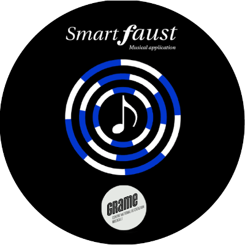

<video autoplay muted id="aniBoule">
<source src="../img/animationBoule.mp4" type="video/mp4" >
</video>

## What's AmStramGrame?

 
<iframe width="560" height="315" src="https://www.youtube.com/embed/r2ySnEmnf1E" frameborder="0" allow="accelerometer; autoplay; encrypted-media; gyroscope; picture-in-picture" allowfullscreen>
</iframe>

### ARTS &amp; SCIENCES

An arts and sciences educational project (STEAM), bringing together services and resources for the educational community. It aims at making abstract scientific concepts more tangible and concrete through musical creation and computer programming.

### FOR WHOM?

A project for primary and middle school students, as well as their teachers. It places sciences and engineering at the heart of the pedagogical approach applying them to the fields of musical and sound creation.

## Tools

### FAUST

<a href="../faust/about">Faust (Functional AUdio STream)</a> is a programming langauge created and developed at <a href="http://www.grame.fr">Grame</a>. It allows for the rapid and simple design of synthesizers (electronic musical instrument) and sound effects for a large number of platforms. In particular, it can be used to create musical web and mobile applications.

 

### THE GRAMOPHONE

<a href="../tools/gramophone">The Gramophone</a> is an audio device/musical instrument specifically designed for the AmStramGrame project. Its various sensors and controllers (e.g., accelerometer, gyroscope, light sensor, etc.) make it react to the user's gestures. Its rechargeable battery offering approximately five hours of autonomy and its powerful speaker make it independent from any computer, bringing it closer to traditional acoustic musical instruments.

### THE FAUST WEB IDE

<a href="faust/ide">The Faust Web IDE</a> is an online tool to write and test Faust programs directly in the web browser and then export them to the Gramophone via the <a href="gramophone/loader"> GramoLoader</a> application. A simplified version of the Faust Web IDE has been created as part of AmStramGrame to facilitate its use by beginners.

### THE FAUST PLAYGROUND

<a href="faust/playground">The Faust Playground</a> is an online tool to assemble programs written in Faust in a simple way with a graphical interface. In particular, it can be used to program the Gramophone, smartphones, etc.

<!--
### SMARTFAUST

SmartFaust est un concept d’applications musicales pour smartphones développé par le langage FAUST. Ces applications ont la particularité de faire uniquement appel aux gestes de l’utilisateur et non pas à un pianotage sur l’écran de l’appareil. Réalisées pour iOS et Android elles savent en outre exploiter les capteurs de mouvement de ces appareils ce qui permet d’en faire de véritables instruments de musique.

-->

### GAMELAN

A set of smartphone musical applications inspired by the Javanese musical tradition to which is added electronic sound universes. The 7 applications (Attackey, Baliphone, DroneLAN, Sequencer, ShakerXY, Sinusoïde, Atomicro) of the GameLan family can be played solo or in orchestra using smartphone movements. No musical prerequisite, only gestures will make the user a musician.

## A collaboration between GRAME-CNCM and Canopé

### GRAME

Grame is a national center for musical creation (CNCM). Its main mission is to enable the design and production of new musical works, in a context of transversality of the arts and of arts/sciences synergies.

### CANOPÉ

Canopé aims at providing support and material to the educational community in France under the supervision of the French ministry of education. It publishes and distributes multi-format educational resources that meet the needs of the educational community.

### PATRONS, SPONSORS, AND PUBLIC PARTNERS

 

