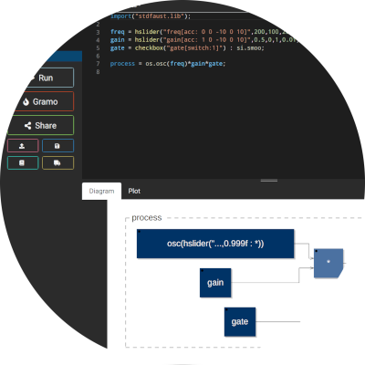
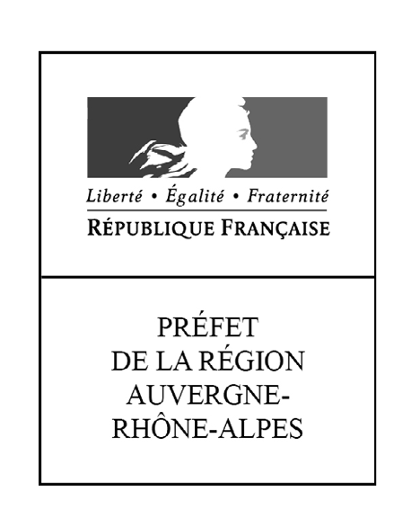

<video autoplay muted id="aniBoule">
<source src="img/animationBoule.mp4" type="video/mp4" >
</video>

## AmStramGrame qu'est-ce que c'est ?

 
<iframe width="560" height="315" src="https://www.youtube.com/embed/r2ySnEmnf1E" frameborder="0" allow="accelerometer; autoplay; encrypted-media; gyroscope; picture-in-picture" allowfullscreen>
</iframe>

### ARTS &amp; SCIENCES

Un projet pédagogique arts &amp; sciences, réunissant  services et ressources à destination de la communauté éducative. Il permet une mise en application concrète de concepts scientifiques parfois abstraits en utilisant la création musicale et la programmation informatique comme vecteurs.

### POUR QUI ?

Un projet destiné aux élèves de cycle primaire et secondaire, ainsi qu'à leurs enseignants. Il place les sciences et l’ingénierie au cœur de la démarche pédagogique en les inscrivant dans le domaine de la création musicale et sonore.

## Les outils

### FAUST

<a href="faust/about">Faust (Functional AUdio STream)</a> est un langage de programmation, créé et développé à <a href="http://www.grame.fr">Grame</a>. Il permet de concevoir de manière simple des synthétiseurs (instrument de musique électronique) et des effets sonores pour un grand nombre de plateformes. Il peut être notamment utilisé pour créer des application web et mobile pour la musique.

### LE GRAMOPHONE

<a href="tools/gramophone">Le Gramophone</a> est un dispositif audio spécialement conçu pour le projet Amstramgrame. Ses différents capteurs et contrôleurs (ex. accéléromètre, gyroscope, capteur de lumière, etc.) le font réagir aux gestes de l’utilisateur. Sa batterie offrant environ cinq heures d’autonomie et son haut-parleur puissant le rendent indépendant de tout ordinateur, le rapprochant ainsi des instruments de musique acoustiques traditionnels.

### LE FAUST WEB IDE

<a href="faust/ide">Le Faust Web IDE</a> est un outil en ligne permettant d'écrire des programmes Faust, de les tester directement dans le navigateur web, puis de les exporter sur le Gramophone via l'application <a href="gramophone/loader">GramoLoader</a>. Une version simplifiée du Faust Web IDE a été créée dans le cadre d'AmStramGrame pour faciliter son utilisation par un public de novices en programmation. 

### LE FAUST PLAYGROUND

<a href="faust/playground">Le Faust Playground</a> est un outil en ligne permettant d'assembler des programmes écrits en Faust de manière simple avec une interface graphique. Il peut notamment être utilisé pour programmer le Gramophone, des smartphones, etc.   

<!--
### SMARTFAUST

SmartFaust est un concept d’applications musicales pour smartphones développé par le langage FAUST. Ces applications ont la particularité de faire uniquement appel aux gestes de l’utilisateur et non pas à un pianotage sur l’écran de l’appareil. Réalisées pour iOS et Android elles savent en outre exploiter les capteurs de mouvement de ces appareils ce qui permet d’en faire de véritables instruments de musique.

-->

### GAMELAN

Ensemble d’applications musicales pour smartphone s’inspirant de la tradition musicale javanaise à laquelle s’ajoute des univers sonores électroniques. Les 7 applications, (Attackey, Baliphone, DroneLAN, Sequenceur, ShakerXY, Sinusoïde, Atomicro) de la famille GameLan peuvent être jouées en solo ou en orchestre utilisant les mouvements du smartphone. Pas de prérequis musical, seul les gestes feront de l’utilisateur un musicien.

## Un collaboration entre GRAME-CNCM et Canopé

### GRAME

Grame est un centre national de création musicale. Sa mission principale est de permettre la conception et la réalisation d’œuvres musicales nouvelles, dans un contexte de transversalité des arts et de synergie arts - sciences.

### CANOPÉ

Réseau Canopé est le réseau de création et d’accompagnement pédagogiques placé sous la tutelle du ministère de l’Éducation nationale. Il édite et diffuse des ressources pédagogiques multi-formats répondant aux besoins de la communauté éducative.

### MÉCÈNES ET PARTENAIRES PUBLICS

 

